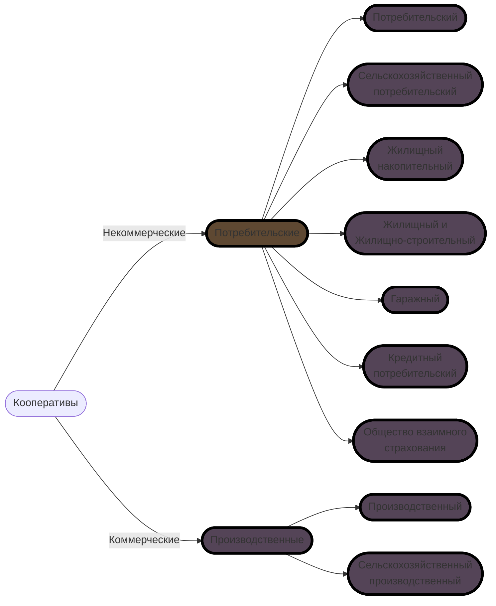

# Классификация кооперативов

```mermaid
graph LR;
classDef class1 fill:#544457, stroke:#000, stroke-width:4px
classDef class2 fill:#32465e, stroke:#000, stroke-width:4px
classDef class3 fill:#455744, stroke:#000, stroke-width:4px
classDef class4 fill:#5e4832, stroke:#000, stroke-width:4px
classDef class5 fill:#5e3332, stroke:#000, stroke-width:4px

   
    A([Кооперативы])
    B([Производственные]):::class1
    C([Потребительские]):::class4
    D([Производственный]):::class1
    E([Сельскохозяйственный
      производственный]):::class1
    F([Потребительский]):::class1
    G([Сельскохозяйственный
         потребительский]):::class1
    H([Жилищный
         накопительный]):::class1
    I([Жилищный и
         Жилищно-строительный]):::class1
    J([Гаражный]):::class1
    K([Кредитный
         потребительский]):::class1
    L([Общество взаимного
         страхования]):::class1

    A-->|Некоммерческие|C;
    A-->|Коммерческие| B;
    B-->D;
    B-->E;
    C-->F;
    C-->G;
    C-->H;
    C-->I;
    C-->J;
    C-->K;
    C-->L;
   click B "https://www.zakonrf.info/gk/106.1/";
   click C "https://www.zakonrf.info/gk/123.2/";
   click D "https://www.zakonrf.info/doc-15088991/";
   click E "https://www.zakonrf.info/doc-13529718/";
   click F "https://www.zakonrf.info/doc-13241339/";
   click G "https://www.zakonrf.info/doc-13529718/";
   click H "https://www.zakonrf.info/zakon-o-jnk/";
   click I "https://www.zakonrf.info/jk/gl11/";
   click J "https://www.zakonrf.info/gk/123.2/";
   click K "https://www.zakonrf.info/doc-16436731/";
   click L "https://www.zakonrf.info/doc-16152437/";
```
